# 「コンテンツ制作」（全15週・計30コマ）カリキュラム設計書
トライデントコンピュータ専門学校 Webデザイン学科 2年生 後期

---

## 1. 全体スケジュール構成（全15週・計30コマ）

- **開講形式**: 週1日・2コマ連続 180分（金曜 1〜2限）
- **標準的な1回の授業サイクル（計180分）**:
  1. **復習・概念解説（約25分）**: 前回の振り返りと、当日扱うコア概念・数学的/工学的背景の解説
  2. **ライブコーディング & マイクロハンズオン（約50分）**: 講師の画面をトレースしながら回路作成・コード実装
  3. **応用演習・クリエイティブ制作（約75分）**: 学んだ仕組みをベースに各自のアイデアやグラフィックを組み込む実践ワーク
  4. **作品共有・トラブルシューティング・まとめ（約30分）**: 各自の進捗確認、詰まったポイントの共有、AIを活用した解決法の振り返り

```mermaid
gantt
    title カリキュラム フェーズ別タイムライン（全15回）
    dateFormat  X
    axisFormat  第%d回
    section 入力・データ基盤
    第1回 Arduino基礎・WebSerial        :0, 1
    第2回 出力値の調整・平滑化(Lerp)      :1, 2
    section ビジュアル表現
    第3回 フレームアニメ(画像切替)      :2, 3
    第4回 p5.js 基礎(数理・描画)         :3, 4
    第5回 p5.js × センサー(アート)       :4, 5
    section サウンド表現
    第6回 Tone.js 基礎(Web Audio)       :5, 6
    第7回 Tone.js × センサー(テルミン)   :6, 7
    section 視聴覚統合・中間
    第8回 映像 × 音 × センサー統合       :7, 8
    第9回 中間小作品制作                 :8, 9
    第10回 中間講評 & 最終課題ガイダンス :9, 10
    section 最終課題制作・展示
    第11回 企画設計・ハード試作         :10, 11
    第12回 Web実装・素材制作            :11, 12
    第13回 インタラクション調整・AI活用 :12, 13
    第14回 筐体組み込み・実機テスト     :13, 14
    第15回 体験型展示会 & 成果講評      :14, 15
```



---

## 2. 全15回 コマシラバス一覧

| 回 | 週 | 単元名・テーマ | 主な学習目標・ハンズオン内容 | 配布・使用機材 / ライブラリ |
|:---:|:---:|---|---|---|
| **第1回** | 第1週 | **単元1: Arduinoの基礎とWeb Serial API入門**<br>【実施済】 | Arduino IDE環境設定、LED点滅（デジタル出力）、PWM明滅（アナログ出力）、距離センサー読取、Web Serial APIによるブラウザ接続（DOM拡大縮小） | Arduino Nano R4, LED, 抵抗, シャープ距離センサー, Web Serial API |
| **第2回** | 第2週 | **単元2: センサー入力値の調整とフィジカルギミック**<br>【改善回】 | 明るさセンサー（CdSセル）の回路（分圧回路）とコード、生データのノイズ・揺らぎ軽減（指数平滑・移動平均）、Arduino側の整形（`constrain`, `map`）、サーボモーター・振動モーターの制御、JS側の正規化（0.0〜1.0）とLerp平滑化の基礎。<br>【課題】入力（スイッチ/距離/CdS）× 出力（サーボ/振動モーター）で触って動く楽しいクラフト作品制作（手書きイラストもOK） | Arduino Nano R4, 距離センサー, CdS光センサー, 10kΩ抵抗, サーボモーター, 振動モーター, タクトスイッチ, 工作用紙/ペン |
| **第3回** | 第3週 | **単元3: センサー連動フレームアニメーション**<br>（画像切り替え・スプライト） | 連番画像（Image Sequence）プリロード、Canvas/DOM描画、手回しアニメーション機の仕組み、センサー値に応じたコマ送り・逆再生・表情変化・スピード制御 | 連番画像素材, Canvas API / CSS steps(), 距離/光センサー |
| **第4回** | 第4週 | **単元4: p5.js 基礎（描画・色彩・運動の数理）** | Canvas描画の基本、`setup()` / `draw()` ループ構造、HSBカラーモード、三角関数（`sin` / `cos`）による周期振動・円運動アニメーション | p5.js (CDN) |
| **第5回** | 第5週 | **単元5: p5.js × センサー（ジェネラティブアート）** | Web Serial APIとp5.jsの結合、センサー値を変数（座標・サイズ・色・速度）へバインド、パーティクル放出・有機的変形・物理挙動シミュレーション | p5.js, 距離/光/スイッチ |
| **第6回** | 第6週 | **単元6: Tone.js 基礎（Web Audioと音響合成）** | Web Audio APIの仕組みとブラウザ制約、Tone.js導入、シンセサイザー（`Tone.Synth`, `Tone.PolySynth`）、音階（スケール）、エフェクト（Reverb, Delay, Filter） | Tone.js (CDN) |
| **第7回** | 第7週 | **単元7: Tone.js × センサー（インタラクティブサウンド）** | センサーテルミン制作（距離で音高・周波数変化）、明暗によるフィルター開閉（ワウ効果）、スイッチ連動のリズムマシン・SEトリガー | Tone.js, 距離/光/スイッチ |
| **第8回** | 第8週 | **単元8: 視聴覚の統合（映像 × 音 × センサー）** | 映像（アニメーション/p5.js）と音（Tone.js）の同時連携、「触ると光って音が鳴る」「近づくと映像とメロディが展開する」マルチモーダル演出の設計 | p5.js, Tone.js, Web Serial |
| **第9回** | 第9週 | **中間制作: ミニインタラクティブ作品制作** | 「入力（センサー） ➔ 処理（Lerp/トリガー） ➔ 出力（映像＋音）」を統合した1画面完結のインタラクティブ作品を180分で設計・実装 | 個人制作（全機材・ライブラリ） |
| **第10回** | 第10週 | **中間講評会 & 最終課題ガイダンス・企画構想** | 中間作品の相互体験デモ・フィードバック。最終課題（オープンキャンパス想定の体験型展示）要件共有、企画ブレインストーミング、体験シナリオ策定 | 企画シート, AIプロンプト演習 |
| **第11回** | 第11週 | **最終制作①: 企画設計・ハードウェアプロトタイプ** | 体験シナリオ決定、入力センサーの選定と回路配線、ハードウェア筐体（ダンボール・紙・アクリル等）の設計・モックアップ制作 | Arduino, クラフト資材, 工具 |
| **第12回** | 第12週 | **最終制作②: ソフトウェア実装・ビジュアル＆サウンド制作** | アニメーション画像・p5.js描画・Tone.jsサウンド素材の制作、Web Serial通信との結合、メインロジックのコーディング | VS Code, Figma, Tone.js, p5.js |
| **第13回** | 第13週 | **最終制作③: インタラクション調整・AIデバッグ** | Lerp係数の最適化（操作の気持ちよさ）、誤検知・ノイズ防止、生成AIを活用したエラー解消・リファクタリング | AI（ChatGPT/Claude/Gemini） |
| **第14回** | 第14週 | **最終制作④: 筐体組み込み・実機テスト・展示設営準備** | 回路と画面を筐体に組み込み、初見ユーザーが直感的に触れるUI/サインの設置、自動リセット・フェイルセーフの動作検証 | 筐体・展示POP・ケーブル固定 |
| **第15回** | 第15週 | **最終成果発表会: 体験型展示会（オープンキャンパス想定）** | ブース設営、来場者体験・相互講評、教員レビュー、全15回の総括 | 展示ブース, 相互評価シート |

---

## 3. 各単元詳細（第1回〜第15回）

---

### 第1回: 単元1: Arduinoの基礎とWeb Serial API入門（実施済）
> **目標**: Arduino Nano R4の基本構造と開発環境を理解し、ブレッドボードでの基本回路（LED・スイッチ・センサー）の構築、およびWeb Serial APIを用いたブラウザ連携の基本手順を体験する。

- **内容振り返り**:
  - Arduino IDE 2.xのセットアップとLチカ（Blink）
  - 回路の基本原則（5V → 負荷 → GND）
  - 距離センサー（GP2Y0A21YK）のアナログ値読取（`analogRead`）とシリアルモニタ出力
  - Web Serial API経由でブラウザ上のHTML要素（緑のbox）の拡大縮小（`scale`）を制御

---

### 第2回: 単元2: センサー入力値の調整とフィジカルギミック（02_センサー入力値の調整）
> **目標**: スイッチによるデジタル制御、距離センサー（復習）および明るさセンサー（CdSセル・分圧回路）のアナログ入力を扱い、センサー生データの課題（ノイズ・揺らぎ）を軽減するアルゴリズム（指数平滑）や値の整形（`constrain`, `map`）を実践する。サーボモーターや振動モーターの出力を安定制御し、入力（スイッチ/距離/CdS）と出力（サーボ/振動）を組み合わせた「触って動く楽しいクラフト作品」を制作できる。また、次週以降のWeb表現につながる「正規化（0〜1）」「Lerp平滑化」の基礎概念を理解する。

- **授業のタイムスケジュール（180分）**:
  - **0:00〜0:20（20分）**: 前回の振り返りとスイッチのデジタル制御（`INPUT_PULLUP`）
  - **0:20〜0:50（30分）**: アナログ入力の基礎：明るさセンサー（CdSセル）の仕組みと10kΩ分圧回路の構築・読取
  - **0:50〜1:15（25分）**: 距離センサーの配線復習とシリアルプロッタでの激しい揺らぎの体感（`analogRead`）
  - **1:15〜1:45（30分）**: センサー値の加工（`constrain`, `map`）、ゆらぎ軽減（指数平滑）とモーター制御（サーボ/振動）
  - **1:45〜2:45（60分）**: **【演習・制作】触って動く楽しいクラフト作品制作**
    - 入力（スイッチ/距離/CdS）× 出力（サーボ/振動モーター）の選定
    - 手書きイラストまたはPC描画素材の作成・モーターへの貼り付け・動作テスト
  - **2:45〜3:00（15分）**: ミニ発表・相互体験・まとめ（JS側のLerp平滑化や次回の画像アニメーションへの展望）
- **概念・キーワード**:
  - **明るさセンサー（CdSセル）と分圧回路**:
    - 光が当たると抵抗が下がり、暗くなると抵抗が上がる特性。
    - 単体では電圧変化を取り出せないため、**10kΩの固定抵抗と直列につないで「電圧を分ける（分圧）」**ことで、アナログピン（A0）に入力する。
  - **生データの課題と加工**:
    - `constrain(val, min, max)`: センサーの測定可能範囲外の異常値・ノイズを切り詰める。
    - `map(val, in_min, in_max, out_min, out_max)`: センサー値（例: 50〜650）をサーボ角度（0〜180）やPWM（0〜255）へ変換。
  - **ゆらぎの軽減（フィルタリング）**:
    - 分解能低下（floorによる丸め）
    - 単純移動平均（複数回サンプリングの平均）
    - **指数平滑（RCローパスフィルタ）**: 過去の値と現在値を重み付け合成し、メモリと処理負荷を抑えてヌルヌル滑らかにする。
      $$\text{val} = (1 - \alpha) \times \text{val} + \alpha \times \text{raw} \quad (0 < \alpha \le 1)$$
  - **出力パーツの制御**:
    - **サーボモーター（SG90等）**: `#include <Servo.h>`、`attach(pin)`、`write(angle)` で0〜180度へ位置決め。
    - **振動モーター**: `analogWrite(pin, power)` によるPWM振動強弱制御。
  - **Web表現への橋渡し（正規化とLerpの予習）**:
    - センサー値を `0.0 〜 1.0` に正規化し、ブラウザ側でも同じくLerp（線形補間）で滑らかに動かせる仕組みを紹介。
- **主要コード**:
  - **CdSセル＋指数平滑＋サーボモーター制御（Arduino）**:
    ```cpp
    #include <Servo.h>

    const int SENSOR_PIN = A0; // CdSセル（10kΩ分圧）
    const int SERVO_PIN = 9;   // サーボモーター信号線
    Servo myServo;

    // 測定環境に応じたセンサー最小値・最大値
    const int SENSOR_MIN = 100;
    const int SENSOR_MAX = 800;

    float filteredValue = 0;
    const float FILTER_WEIGHT = 0.1; // 0.1＝過去9割＋現在1割（ゆらぎ除去）

    void setup() {
      Serial.begin(9600);
      myServo.attach(SERVO_PIN);
    }

    void loop() {
      int raw = analogRead(SENSOR_PIN);
      
      // 指数平滑フィルタでゆらぎを除去
      filteredValue = (1.0 - FILTER_WEIGHT) * filteredValue + FILTER_WEIGHT * raw;
      
      // 範囲制限とサーボ角度（0〜180度）へのマッピング
      int clamped = constrain((int)filteredValue, SENSOR_MIN, SENSOR_MAX);
      int angle = map(clamped, SENSOR_MIN, SENSOR_MAX, 0, 180);

      myServo.write(angle);

      // デバッグ出力
      Serial.print("Raw:");
      Serial.print(raw);
      Serial.print(" Filtered:");
      Serial.print((int)filteredValue);
      Serial.print(" Angle:");
      Serial.println(angle);

      delay(20);
    }
    ```
- **第2回ミニ制作課題**:
  - **テーマ**: 「触って動く楽しいクラフト作品」
  - **入力**: 「スイッチ」or「距離センサ」or「明るさセンサ（CdS）」から選択
  - **出力**: 「サーボモーター」or「振動モーター」から選択
  - **要件**:
    - 工作用紙・厚紙にイラストを描き、切り抜いてサーボホーンや振動モーターにセロテープ等で貼り付けて動かす。
    - **手書きのイラストも大歓迎（もちろんIllustrator等の描画ソフトで作成・印刷してもOK）**。※Web上の画像・既存イラストの無断拝借は禁止（トレースや自作アレンジは可）。
    - センサー値の範囲調整（`constrain`, `map`）とゆらぎ軽減を行い、意図通りの動きを実現すること。

---

### 第3回: 単元3: センサー連動フレームアニメーション（画像切り替え・スプライト）
> **目標**: 連番画像（Image Sequence）やスプライトシートを用いて、Webサイト用のアニメーションではなく、パラパラマンガのように「本来のアニメーション」をセンサー値で直接操るインタラクションを実装できる。

- **概念・キーワード**:
  - 手回し映写機（キネトスコープ／ゾートロープ／フェナキストスコープ）のメタファー
  - 連番画像（Frame 00〜Frame N）のプリロード（非同期ロード完了待ち）
  - HTML5 Canvas の `drawImage()` による高速フレーム描画
  - CSS `steps()` とスプライトシートによるコマ送り制御
  - **センサー値のマッピング手法**:
    - **手法A（位置連動・手回し型）**: 正規化値（0.0〜1.0）× (総フレーム数 - 1) ＝ 現在のコマ番号（手を近づけるとコマが進み、遠ざけると巻き戻る）
    - **手法B（速度連動・歩行型）**: センサー値（速さ・明るさ）に応じて再生フレームレート（FPS）を動的に加算（歩く速さが変わる）
    - **手法C（状態切替型）**: 距離・明暗のしきい値に応じて、別のアニメーションシーケンス（怒る・喜ぶ・寝る）へ切り替える
- **主要コード（Canvas連番画像再生）**:
  ```javascript
  const totalFrames = 30;
  const frames = [];
  let loadedCount = 0;

  // 1. 画像のプリロード
  for (let i = 0; i < totalFrames; i++) {
    const img = new Image();
    img.src = `assets/frame_${String(i).padStart(2, '0')}.png`;
    img.onload = () => {
      loadedCount++;
      if (loadedCount === totalFrames) console.log("全画像ロード完了");
    };
    frames.push(img);
  }

  // 2. センサー値（正規化値 0.0〜1.0）からフレーム番号を決定
  function drawFrame(normVal) {
    if (loadedCount < totalFrames) return;
    const canvas = document.getElementById('anim-canvas');
    const ctx = canvas.getContext('2d');
    
    // 0.0〜1.0 を 0〜29 のインデックスにマッピング
    const frameIndex = Math.min(Math.floor(normVal * totalFrames), totalFrames - 1);
    
    ctx.clearRect(0, 0, canvas.width, canvas.height);
    ctx.drawImage(frames[frameIndex], 0, 0, canvas.width, canvas.height);
  }
  ```
- **演習課題**:
  - 自分で描いたイラスト（3〜10コマ程度）または写真のコマ送り素材を用意し、距離センサーや光センサーで「コマが進む」「キャラクターが走る」「表情が変わる」インタラクティブアニメーションを完成させる。

---

### 第4回: 単元4: p5.js 基礎（描画・色彩・運動の数理）
> **目標**: クリエイティブコーディングライブラリ「p5.js」の描画構造（`setup`, `draw`）を理解し、数学（三角関数・乱数・ベクター）と色彩（HSB）を用いた動的なグラフィックを生成できる。

- **概念・キーワード**:
  - Processingとp5.jsの出自、Web Canvasでのクリエイティブコーディング
  - 実行サイクル: `setup()`（初期化）と `draw()`（60fpsループ）
  - 基本図形（`circle`, `rect`, `line`, `vertex`）とスタイリング（`stroke`, `fill`, `strokeWeight`）
  - 色彩空間: RGBとHSBの違い（色相 Hue 0〜360度、彩度 Saturation、明度 Brightness）
  - 数理アニメーション:
    - `sin()` / `cos()` による滑らかな波打ち・円運動・呼吸のような伸縮
    - `frameCount` と `millis()` による時間経過の扱い
    - `random()` と `noise()`（パーリンノイズ）による有機的な揺らぎ
- **演習課題**:
  - マウスや時間経過に応じて、有機的に形や色が変わるジェネラティブグラフィック作品を作成する。

---

### 第5回: 単元5: p5.js × センサー（ジェネラティブアート & 物理挙動）
> **目標**: Web Serial APIで受信したセンサー値をp5.jsの描画パラメータに統合し、物理現象（パーティクル、引力・反発、波形）をリアルタイムに操作するジェネラティブアートを構築できる。

- **概念・キーワード**:
  - p5.jsとWeb Serial APIの連携構造（グローバル変数へのセンサー値格納とLerp追従）
  - パーティクルクラス（Particle Class）の作成（位置 `pos`、速度 `vel`、寿命 `lifespan`、色 `color`）
  - センサー値を物理パラメータへマッピング:
    - 距離が近づく ➔ パーティクルの発生量激増 / 反発力の強化
    - 暗くなる ➔ 色相（Hue）の変色 / パーリンノイズの荒れ具合（カオス度）の増大
    - スイッチを押す ➔ 画面全体の爆発・波紋エフェクト（Ripple）
- **主要コード（p5.js内でのセンサー値受取とLerp）**:
  ```javascript
  let sensorTarget = 0;
  let sensorCurrent = 0;

  function setup() {
    createCanvas(windowWidth, windowHeight);
    colorMode(HSB, 360, 100, 100, 100);
  }

  function draw() {
    background(0, 0, 10, 20); // 残像効果
    // Lerp平滑化
    sensorCurrent = lerp(sensorCurrent, sensorTarget, 0.08);

    // センサー値に応じた幾何学模様
    let numCircles = floor(map(sensorCurrent, 0, 1, 5, 50));
    let radius = map(sensorCurrent, 0, 1, 50, 300);

    push();
    translate(width / 2, height / 2);
    for (let i = 0; i < numCircles; i++) {
      let angle = TWO_PI / numCircles * i + frameCount * 0.02;
      let x = cos(angle) * radius;
      let y = sin(angle) * radius;
      fill((sensorCurrent * 360 + i * 10) % 360, 80, 100, 80);
      noStroke();
      circle(x, y, 20);
    }
    pop();
  }
  ```
- **演習課題**:
  - 手の距離や明暗によって幾何学パターンやパーティクルが有機的に反応する、画面いっぱいのビジュアルインスタレーションを作る。

---

### 第6回: 単元6: Tone.js 基礎（Web Audioと音響合成）
> **目標**: ブラウザ上で音を合成する「Tone.js」の基本構造を理解し、オシレーター・シンセサイザー・音階・エフェクトを用いたプログラミングによるサウンド生成ができる。

- **概念・キーワード**:
  - Web Audio APIの仕組みとブラウザ制約（「ユーザーがボタンを押すまで音を鳴らしてはいけない」Autoplay Policy）
  - Tone.jsの導入と `Tone.start()`
  - シンセサイザーの種類:
    - `Tone.Synth`: 基本的な単音シンセ（メロディ向き）
    - `Tone.MonoSynth`: アナログシンセ風の重厚な音
    - `Tone.PolySynth`: 和音が鳴らせるシンセ
    - `Tone.MembraneSynth`: キック・太鼓などの打楽器音
  - 音階（Musical Notes）の表記（`"C4"`, `"D4"`, `"G4"` 等）とペンタトニックスケール（誰が弾いても不協和音にならない音階）
  - 音色の調整: オシレーター波形（sine, triangle, square, sawtooth）、ADSRエンベロープ（Attack, Decay, Sustain, Release）
  - オーディオエフェクト: `Tone.Reverb`（空間の広がり）、`Tone.FeedbackDelay`（やまびこ）、`Tone.Filter`（高音/低音のカット）
- **演習課題**:
  - ブラウザ上のボタンやキーボードを押すと、ペンタトニックスケールの心地よいシンセ音やパーカッションが鳴るWebシンセサイザーを作成する。

---

### 第7回: 単元7: Tone.js × センサー（インタラクティブサウンド & テルミン）
> **目標**: センサーの入力値をTone.jsの周波数・フィルター・音量・テンポへマッピングし、物理的に触って演奏できる電子楽器や効果音発生器を制作できる。

- **概念・キーワード**:
  - **テルミンの原理**: 手の距離に応じて音の高さ（ピッチ）と音量（ボリューム）を連続的に変える
  - 周波数の対数マッピング: 人間の耳は対数的に音高を感じる（`Tone.Frequency("C3").toFrequency()` 等の活用）
  - フィルターモジュレーション: CdS光センサーを手で覆うと音がこもり、光が当たると音が明るく開く（ローパスフィルターの遮断周波数 `filter.frequency.rampTo()`）
  - リズムトリガー: スイッチを押した瞬間にドラムが鳴る、または一定テンポ（BPM）をセンサーで可変する
- **主要コード（センサーテルミン）**:
  ```javascript
  const synth = new Tone.Synth().toDestination();
  const filter = new Tone.Filter(1000, "lowpass").toDestination();
  synth.connect(filter);

  // センサー値（0.0〜1.0）に応じた音響制御
  function updateSound(normVal, isNear) {
    if (isNear) {
      // 0.0〜1.0 を 周波数 130Hz(C3) 〜 523Hz(C5) へマッピング
      const freq = 130 + normVal * (523 - 130);
      synth.triggerAttack(freq);
      
      // フィルターの開閉
      filter.frequency.rampTo(200 + normVal * 3000, 0.05);
    } else {
      synth.triggerRelease();
    }
  }
  ```
- **演習課題**:
  - 距離センサーに手を近づけると音階が奏でられ、明暗で音色が劇的に変わる「フィジカル・テルミン楽器」を実装する。

---

### 第8回: 単元8: 視聴覚の統合（映像 × 音 × センサー）
> **目標**: ここまでに学んだ「画像アニメーション / p5.js」と「Tone.js」を同時に連動させ、入力（センサー）に対して映像と音が協調して反応するマルチモーダルなインタラクションを構築できる。

- **概念・キーワード**:
  - **マルチモーダル（多感覚）デザイン**: 視覚と聴覚が1ミリ秒のズレもなく同期したときに人間が感じる「本当に触っている感覚（手応え）」
  - 視聴覚の同期パターン:
    - **パターンA（インパクト連動）**: スイッチを押す / センサーが閾値を超える ➔ 画面が激しく光り爆発する ＋ 重低音キックが鳴る
    - **パターンB（連続的モーフィング）**: 距離を近づける ➔ キャラクターが笑顔に変形する ＋ 音のスケールが明るく高くなる
    - **パターンC（アンビエント調和）**: 部屋の明るさに応じて ➔ 背景色とパーティクルの流れが夜モードに変わる ＋ 穏やかなドローン・アンビエント音が響く
  - コードのアーキテクチャ整理: 入力管理モジュール、描画モジュール、音響モジュールをすっきり関数分割する設計作法
- **演習課題**:
  - 1つのセンサー入力に対し、ビジュアル変化とサウンド変化が完全に同期して快感を生み出すミニプロトタイプを制作する。

---

### 第9回: 中間制作: ミニインタラクティブ作品制作
> **目標**: 学んだ技術（センサー ＋ アニメーション/p5.js ＋ Tone.js）を総動員し、1画面完結のオリジナリティある「ミニ体験型コンテンツ」を180分で企画・実装する。

- **制作レギュレーション**:
  - 入力: 距離センサー、CdS光センサー、タクトスイッチのいずれか（複数可）
  - 処理: Web Serial API ＋ 正規化 / Lerp / 閾値判定
  - 出力: 「映像（フレームアニメーションまたはp5.js）」＋「音（Tone.js）」
  - テーマ: 自由（例: 触ると怒る目玉、手をかざすと咲く花とオルゴール、光を食べる怪獣、手回しおみくじ）
- **制作フロー（180分）**:
  - 0:00〜0:20（20分）: アイデア構想・スケッチ
  - 0:20〜2:20（120分）: 実装（回路構築・グラフィック・サウンド・通信）
  - 2:20〜2:50（30分）: 動作テスト・演出ブラッシュアップ
  - 2:50〜3:00（10分）: コードコミット・次週講評会の準備

---

### 第10回: 中間講評会 & 最終課題ガイダンス・企画構想
> **目標**: 中間作品を全員で触り合って相互評価を行い、最終課題（オープンキャンパス想定の体験型展示）の要件を理解した上で、独自の作品コンセプトと体験シナリオを設計する。

- **授業のタイムスケジュール（180分）**:
  - **0:00〜1:10（70分）**: **中間作品プチ展示会・相互体験セッション**
    - 机の上に各自PCとArduinoを並べ、クラスメイトの作品を自由に触って回る。
    - 相互評価シート記入（「触り心地の良さ」「アイデアのユニークさ」「改善点」）
  - **1:10〜1:30（20分）**: 講師講評と優秀作品のピックアップ
  - **1:30〜2:10（40分）**: **最終課題ガイダンス & 体験型展示の要件定義**
    - 学校イベント（オープンキャンパス等）で来場者に体験してもらうシチュエーションの共有
    - ハードウェア筐体（クラフト性）、アフォーダンス（触り方の誘導）、無人展示での耐久性
  - **2:10〜3:00（50分）**: **企画ブレインストーミング & 体験シナリオ策定**
    - 生成AIを活用した企画の壁打ち・テーマ絞り込み
    - 「体験シナリオシート」（誰が・どう触ると・何が起きるか）の記入

---

### 第11回: 最終制作①: 企画設計・ハードウェアプロトタイプ
> **目標**: 企画書を具体化し、必要なセンサー・電子部品の回路を組み、ダンボール・厚紙・アクリルなどのクラフト素材を用いてハードウェア筐体のモックアップを制作する。

- **内容**:
  - 企画の確定と機能要件の洗い出し（必要なセンサー数、スイッチの配置）
  - 回路の確定と配線テスト（ブレッドボード上での安定動作確認）
  - 外装・筐体のモックアップ制作（画面とセンサーの物理的な位置関係、配線の隠し方の検討）
  - 講師による個別企画レビュー（実現可能性・スコープ調整のアドバイス）

---

### 第12回: 最終制作②: ソフトウェア実装・ビジュアル＆サウンド制作
> **目標**: 画面上に表示するビジュアル素材（イラスト・連番画像・p5.jsコード）とTone.jsサウンドを制作し、Web Serial API通信とメインロジックを結合させる。

- **内容**:
  - グラフィック・アニメーション素材の制作（Illustrator, Photoshop等からの書き出し）
  - Tone.jsの音色プログラミング・SE/BGMの実装
  - センサー入力値とビジュアル/サウンドパラメータのバインド
  - 基本機能が通しで動作するアルファ版の完成

---

### 第13回: 最終制作③: インタラクション調整・AIデバッグ
> **目標**: 操作の手応え（Lerp係数・遊び・感度）をチューニングし、生成AIを活用してエラー解消やコードの整理を行い、体験の「気持ちよさ」を極限まで高める。

- **内容**:
  - センサー値の閾値やLerp係数のマイクロチューニング（触ったときの反応の良さ・ラグの解消）
  - チャタリング防止、外乱光・ノイズによる誤作動のフィルタリング
  - 生成AI（ChatGPT / Claude / Gemini）を用いたコードリファクタリング、未解決バグの自己解決
  - ベータ版の完成と学生同士でのテストプレイ

---

### 第14回: 最終制作④: 筐体組み込み・実機テスト・展示設営準備
> **目標**: 回路とPCを物理筐体に固定し、初見のユーザーが説明なしで楽しめるUI/サイン（遊び方ガイド）を整備して、長時間の連続稼働に耐える展示用作品を完成させる。

- **内容**:
  - 回路・ケーブルの固定（断線事故防止、テープ・結束バンドでの補強）
  - アフォーダンスの強化: 「ここを押してね」「手をかざしてみて」等の案内サイン・POPの制作
  - フェイルセーフ設計: 一定時間人が離れたら自動で初期画面・デモモードに戻るリセットタイマーの実装
  - 最終リハーサル（ブース配置確認、電源確保、照明環境のチェック）

---

### 第15回: 最終成果発表会: 体験型展示会（オープンキャンパス想定）
> **目標**: 学校イベント・オープンキャンパスを想定した模擬展示形式でブースを設営し、来場者に作品を体験してもらいながらプレゼンテーションを行い、相互講評を通じてモノづくりの視座を深める。

- **授業のタイムスケジュール（180分）**:
  - **0:00〜0:30（30分）**: 展示ブース設営・最終導通確認
  - **0:30〜2:00（90分）**: **体験型展示セッション（前半・後半入れ替え制）**
    - 前半（45分）: Aグループが出展・説明、Bグループが来場者として体験・投票
    - 後半（45分）: Bグループが出展・説明、Aグループが来場者として体験・投票
  - **2:00〜2:40（40分）**: 相互講評・教員総評・優秀作品発表
  - **2:40〜3:00（20分）**: 片付け・授業全体の振り返りと後期の学びの総括

---

## 4. 課題仕様書 & 評価ルーブリック

### 1. 第2回ミニ制作課題 仕様書（第2回授業内 制作・発表）
- **テーマ**: **「触って動く楽しいクラフト作品」**
- **目的**: センサーの入力値を適切な範囲に加工（`constrain`, `map`）し、ゆらぎを軽減した上で、サーボモーターまたは振動モーターを意図通りに動かす楽しさを体験する。
- **入力パーツ（いずれか1つ以上を選択）**:
  - タクトスイッチ（デジタル入力）
  - 距離センサー（シャープ測距モジュール GP2Y0A21YK / アナログ入力）
  - 明るさセンサー（CdSセル ＋ 10kΩ分圧回路 / アナログ入力）
- **出力パーツ（いずれか1つを選択）**:
  - サーボモーター（0〜180度の角度制御）
  - 振動モーター（PWMアナログ出力による振動強弱制御）
- **制作要件**:
  - 厚紙や工作用紙に描いたイラストを切り抜き、モーターの軸や本体にセロテープ等で貼り付けて動かす。
  - **手書きのイラストも大歓迎**（Illustrator/Photoshop等の描画ソフトで作成・印刷してもOK）。
  - ※Web上にある既存画像やイラストの無断拝借は禁止（自作トレース・アレンジは可）。
  - 授業終了前（残り約15分）に全員の作品を動かし、相互に動作を確認する。

---

### 2. 中間課題 仕様書（第9回制作 / 第10回発表）
- **提出物**:
  1. ソースコード一式（GitHubリポジトリ または Zip）
  2. 作品説明シート（タイトル、コンセプト、使ったセンサー、工夫した点）
- **必須要件**:
  - Arduinoのセンサー（距離または光）またはスイッチを1つ以上使用していること。
  - Web Serial APIでブラウザと正常に通信していること。
  - JavaScript側で正規化（0〜1）またはLerp平滑化、もしくは閾値判定が行われていること。
  - 「映像（コマ送りアニメ または p5.js）」と「音（Tone.js）」の両方が連動して変化すること。

---

### 3. 最終課題 仕様書（第11回〜第14回制作 / 第15回展示）
- **テーマ**: **「思わず触りたくなる、体験型インタラクティブ作品」**
- **想定シーン**: 学校のオープンキャンパス・募集イベントで、来場した高校生や一般客がブースの前で直感的に遊べる展示作品。
- **必須要件**:
  1. **フィジカル入力（ハードウェア）**:
     - Arduino Nano R4とセンサー/スイッチを用いた独自の入力装置があること。
  2. **データ最適化**:
     - 生データをそのまま使わず、ノイズ対策・正規化・Lerp補間・閾値処理が適切に組み込まれていること。
  3. **マルチモーダル出力（Web）**:
     - 画面上の映像表現（連番画像フレームアニメーション または p5.jsジェネラティブアート）が連動すること。
     - Tone.jsによるサウンド（効果音、シンセ音階、フィルター変化等）が連動すること。
  4. **クラフト・筐体**:
     - ブレッドボードやマイコンがむき出しにならず、作品の世界観に合わせた外装・筐体（ダンボール、工作用紙、アクリル、木箱等）が作られていること。
  5. **UI/UX & 展示設計**:
     - 初見のユーザーが「どこをどう触ればいいか」わかる視覚的サインやアフォーダンスがあること。
     - 人が離れた後に初期状態に戻る「オートリセット機能」または「待機画面」が実装されていること。

---

### 3. 成績評価ルーブリック（配点基準）

| 評価項目 | 配点 | S（極めて優秀） | A（良好） | B（標準） | C（要努力） |
|---|:---:|---|---|---|---|
| **独創性・体験価値**<br>（アイデア・楽しさ） | **25%** | 他にない斬新な発想で、初見のユーザーが歓声を上げて夢中になる体験が設計されている。 | コンセプトが明確で、触ったときの驚きや楽しさが十分に感じられる。 | 既成のサンプルコードから一歩進んだ独自のアイデアが盛り込まれている。 | サンプルコードの数値を少し変えた程度にとどまっている。 |
| **技術実装力**<br>（通信・データ処理・制御） | **25%** | Web Serial通信、正規化・Lerp、閾値判定、Tone.js、アニメ/p5.jsが破綻なく高度に統合されている。 | センサーと映像・音が安定して連動し、ノイズやカクつきが適切に抑えられている。 | 必須要件を満たし、基本的な連動処理が正しく動作している。 | 通信が頻繁に途切れる、またはデータの整形が不十分で挙動が不安定。 |
| **クラフト & UI/UX**<br>（筐体・アフォーダンス） | **25%** | 筐体の作り込みが美しく、説明不要で誰でも直感的に遊べるサインやリセット処理が完璧である。 | 外装が工夫されており、遊び方の案内やケーブルの固定がしっかりなされている。 | むき出しを避け、最低限の筐体や操作説明が用意されている。 | 部品が散乱して配線が抜けやすく、遊び方が全くわからない。 |
| **取り組み姿勢 & AI活用**<br>（試行錯誤・デバッグ） | **25%** | 生成AIを相棒として深く活用し、自力でエラーを解決しながら意欲的に機能拡張に取り組んだ。 | AIやドキュメントを参照しながら自力でトラブルを解決し、期日通りに完成させた。 | 授業中の指導やAIの助けを受けながら、最後まで作り切ることができた。 | エラーで手が止まり、制作意欲や相互講評への参加度が低い。 |

---

## 5. トラブルシューティング & 指導ガイド

### 1. Web Serial API 特有のトラブルと回避策
1. **「ポートがビジーで開けない / Failed to open serial port」**:
   - **原因**: Arduino IDEの「シリアルモニタ」が開いたまま、あるいは別ブラウザタブで接続したままになっている。
   - **対処法**: Arduino IDEのシリアルモニタを「×」で閉じ、ブラウザの再読み込み（F5 / Cmd+R）を行う。
2. **「データが途切れる・NaNになる」**:
   - **原因**: シリアル通信はバイト単位で届くため、改行コード（`\n`）の途中で読み取ってしまうことがある。
   - **対処法**: バッファ変数を用意し、`split('\n')` で完全な1行が得られた場合のみ `parseInt` / `parseFloat` を実行する定型コードを徹底する。

### 2. センサー回路のトラブルと指導
1. **「値が0または最大値（1023）に張り付く」**:
   - **原因**: GNDが抜けている、ブレッドボードの行が1マスずれている、ショートしている。
   - **対処法**: 必ずUSBを抜いてから、5V ➔ パーツ ➔ 抵抗 ➔ GND の一筆書き導通を目視確認させる。
2. **「CdS光センサーの変化が小さすぎる」**:
   - **原因**: 分圧抵抗（10kΩ）の抵抗値が環境照度と合っていない。
   - **対処法**: Arduinoの生値をシリアルプロッタで確認し、手で覆ったときの変化幅を測定させる。

### 3. 生成AIを活用したトラブル解決プロンプト例
学生が自力でエラーを解決できるよう、以下のプロンプトテンプレートを推奨する：

> **【エラー解決プロンプト例】**
> ```text
> 私はArduino Nano R4とブラウザをWeb Serial APIで接続し、距離センサーの値でCanvasの画像を切り替えるプログラムを書いています。
> ブラウザのコンソールに「Uncaught TypeError: Cannot read properties of undefined」と表示されて画像が表示されません。
> 関連するJavaScriptのコードは以下の通りです：
> [コードを貼り付け]
> 原因と、修正すべきコードを初心者向けに分かりやすく解説してください。
> ```
